# Fusan

An Android Application to process the screen time of each individual in a video.

ADD ON:
**A small Feature contributing to Digital WellBeing. Locks the screen until the given time. **

__Technology Used__

1. Android Studio( Java Programming).
2. Firebase (For Authentication and database purposes).
2. OpenCv Python (To process the Video).
3. Haar Cascade Algorithm(To Identify Faces).
4. Socket Programming(Python in Server Socket and Java in Client Socket).

__App User Interface__

| Splash Screen | SignIn |  SignUp |
| ------------- | ------------- | ------------- |
| 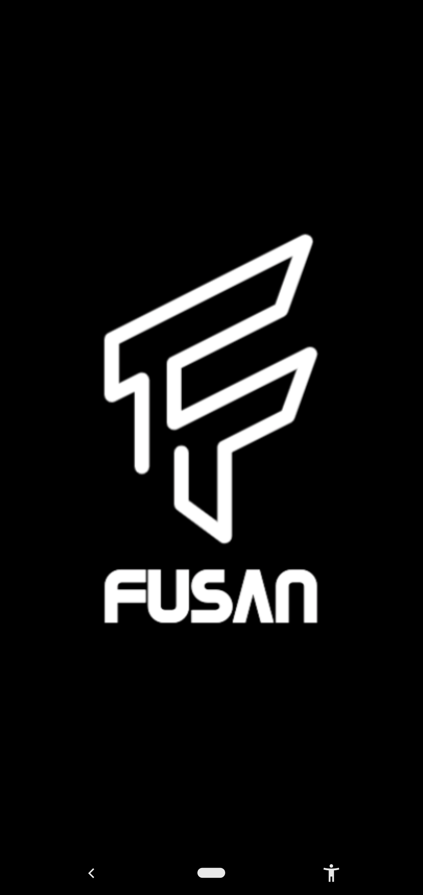 | 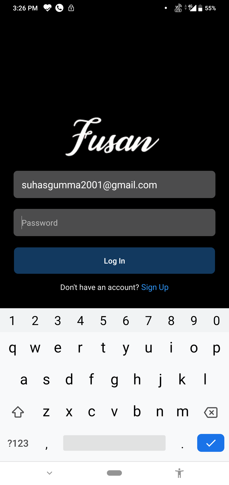 | 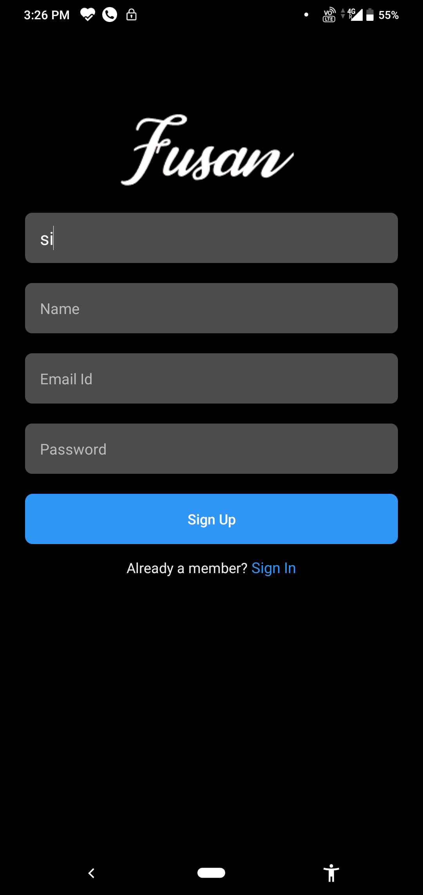 |

| DashBoard | Video Analysis Screen |  VA Screen 1 |
| ------------- | ------------- | ------------- |
| 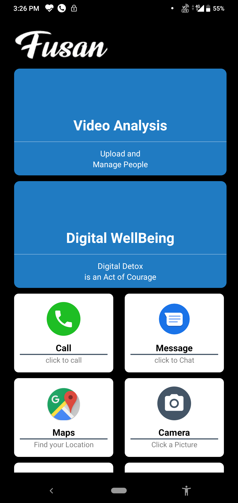 | 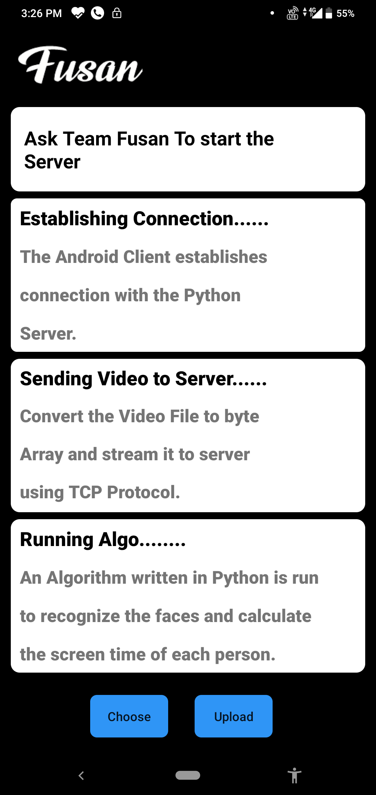 | 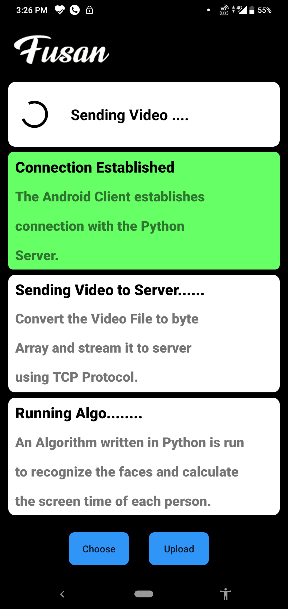 |

| VA Screen 2 | Most Appeared Person | Person List |
| ------------- | ------------- | ------------- |
| 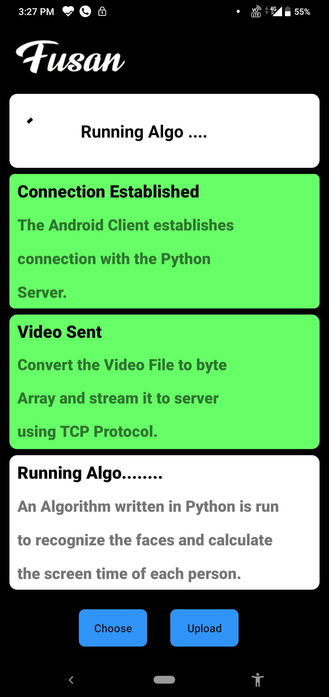 | 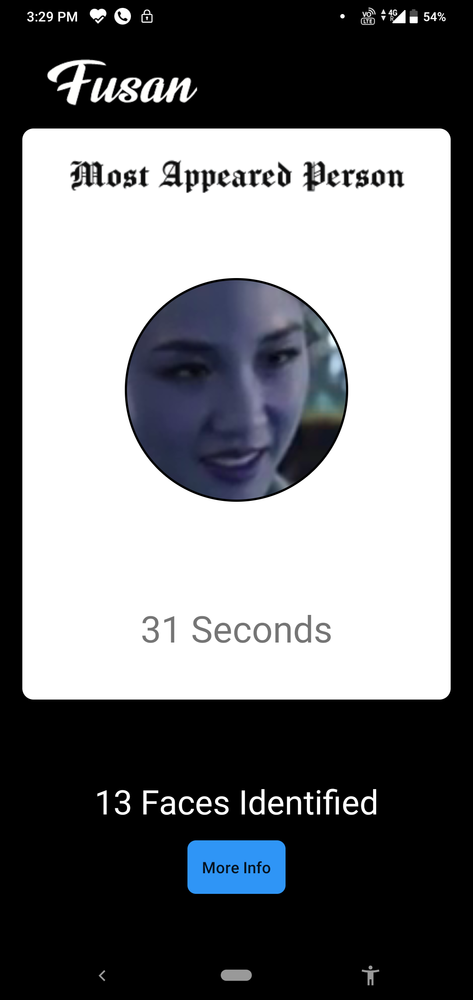 | 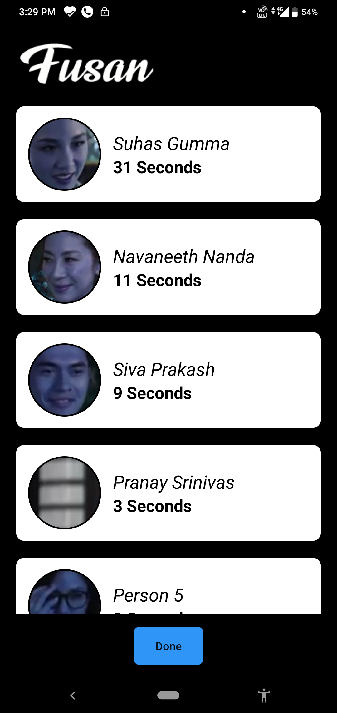 |

| Person List | Digital WellBeing | Lock Screen |
| ------------- | ------------- | ------------- |
| 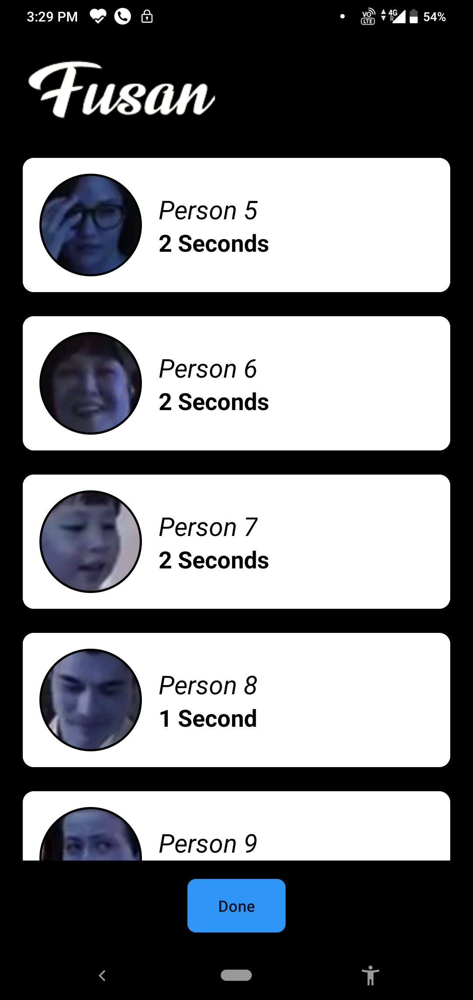 | 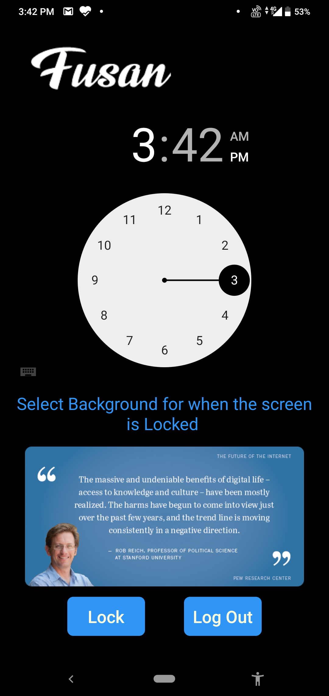 | 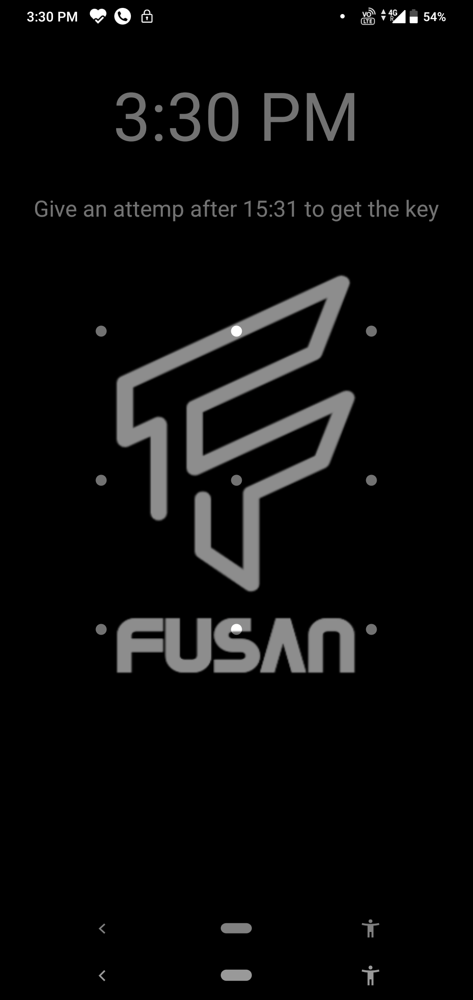 |

| FeedBack Screen |
| ------------- |
| 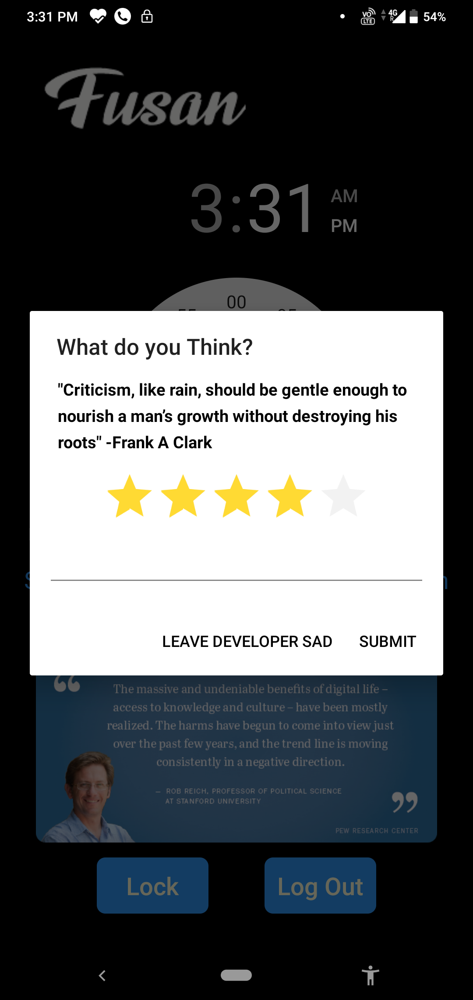 |

__FireBase__

| Authentication |
| ------------- |
| 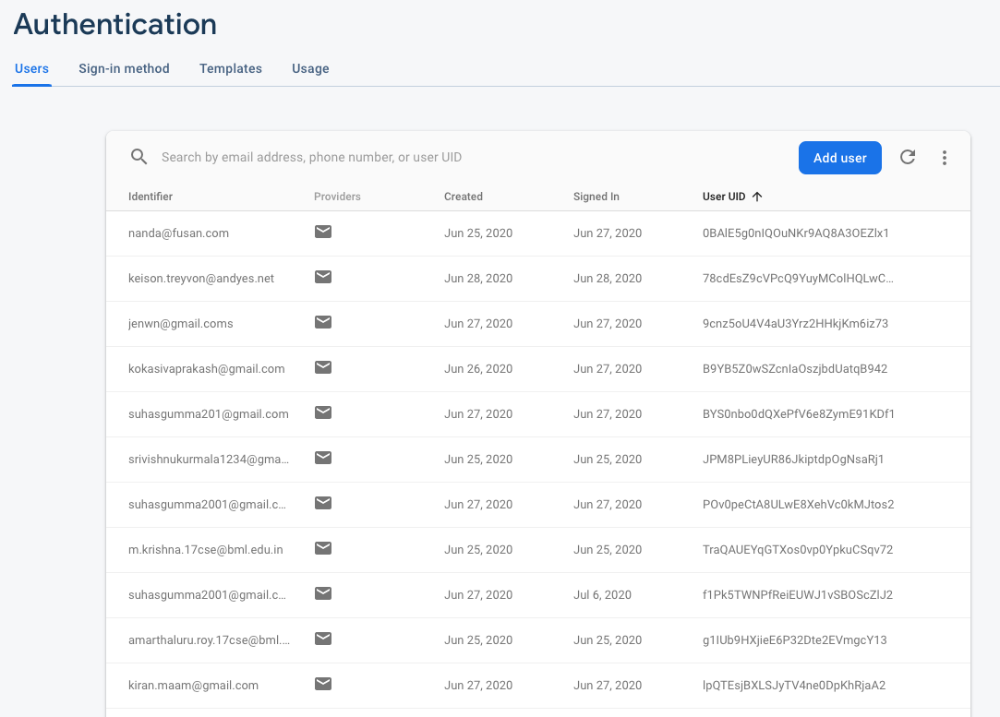 |

| Real Time DataBase |
| ------------- |
| 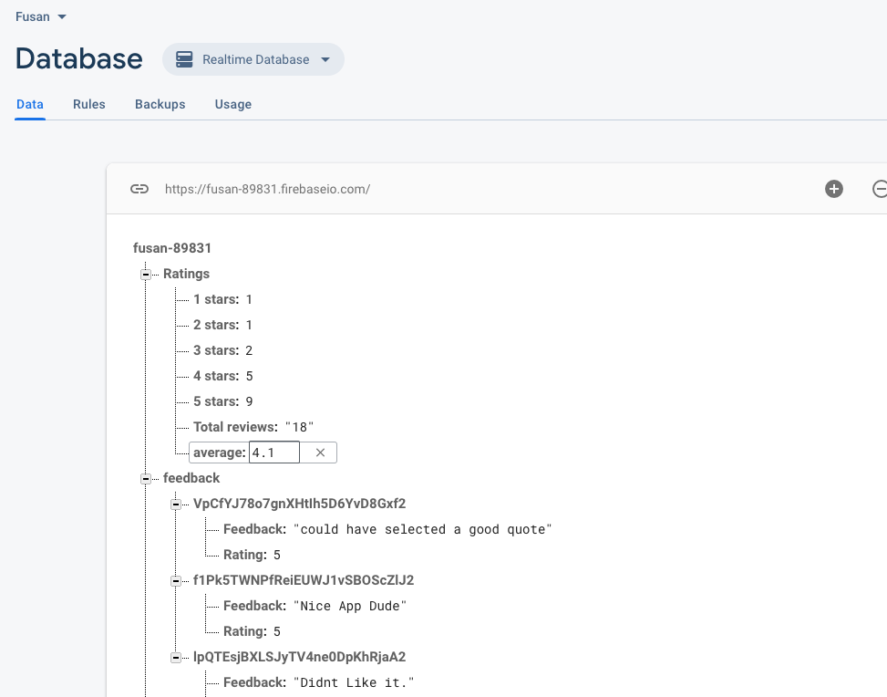 |

| Python Socket |
| ------------- |
|  |
